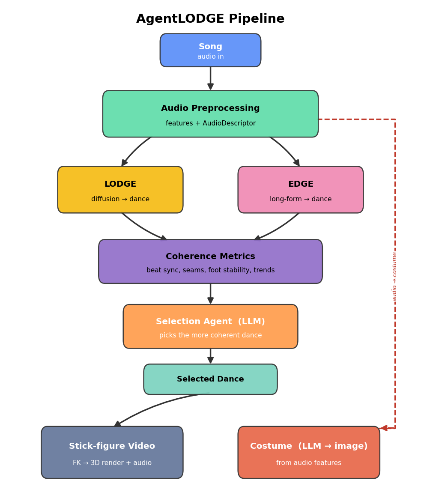
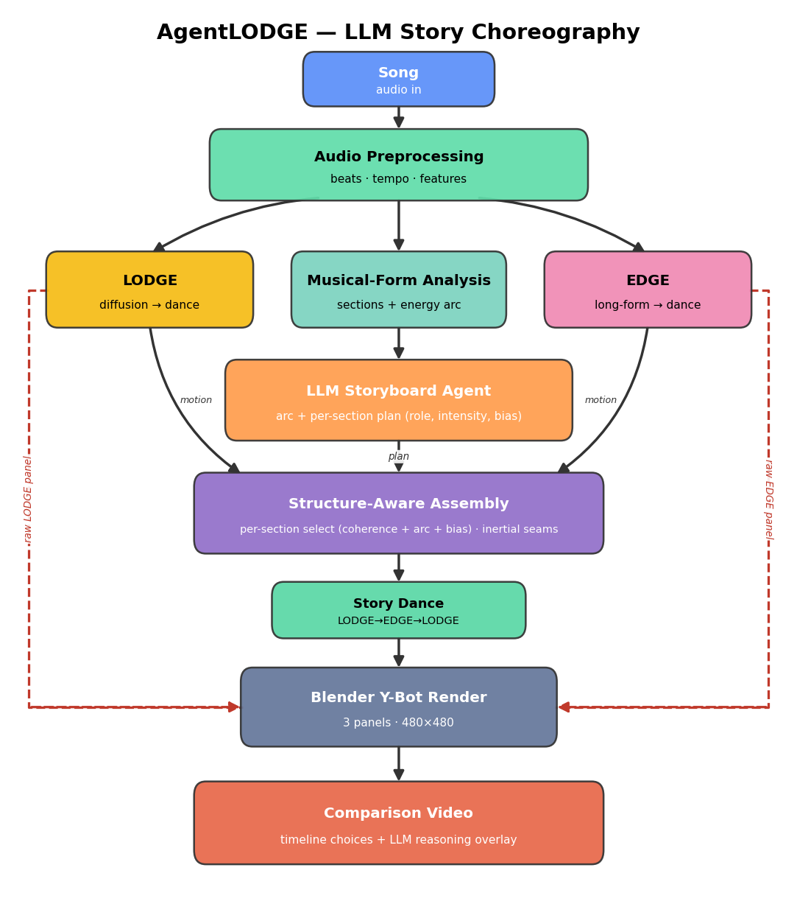

# AgentLODGE

End-to-end pipeline that accepts a song, generates dances with **LODGE** and **EDGE** in parallel, then either **selects** the more coherent whole dance with an LLM agent **or intertwines both** into a single hybrid whose style source changes per musical section (see [Hybrid mode](#hybrid-intertwined-mode)), and generates a costume illustration derived entirely from the audio.



## Pipeline

1. **Audio preprocessing** — Librosa 35-dim features (LODGE) and Jukebox embeddings (EDGE) at 30 FPS
2. **Parallel dance generation** — LODGE global+PDDM and EDGE long-form (5s clips, 2.5s overlap)
3. **Dance selection agent** — an LLM reasons over per-window **long-term coherence** signals (seam smoothness, jitter, foot stability, sustained beat-sync trend, variety), scores each dance on a coherence rubric, and picks the more coherent long-form dance; beat alignment and diversity are secondary tie-breakers. *(Alternatively, enable [Hybrid mode](#hybrid-intertwined-mode) to intertwine LODGE and EDGE per section instead of picking one.)*
4. **Dance video** — the selected motion is rendered to an mp4 (audio muxed). Backends (set with `AGENTLODGE_RENDER_BACKEND`): a fast **stick figure** (SMPL forward kinematics + matplotlib, no extra assets, default), or **Blender** 3D rendering in an EDGE-style studio (cyclorama backdrop, spotlight vignette, follow camera). The Blender character is chosen with `AGENTLODGE_RENDER_CHARACTER`: `smplx` (smooth SMPL-X mesh, needs the licence-gated SMPL-X body model) or `ybot` (EDGE's segmented Mixamo Y-Bot robot, needs EDGE's `ybot.fbx` — no SMPL-X model required)
5. **Costume description agent** — an LLM turns the song's acoustic features (tempo, energy, timbre, key/mode, rhythmic density) plus the `LODGE_GENRE` hint into a costume description
6. **Costume image generation** — OpenAI (`gpt-image-1`) or Gemini Imagen renders the audio-derived description

## Hybrid (intertwined) mode

By default the pipeline picks **one** generator's whole dance. Setting `AGENTLODGE_HYBRID=1`
instead assembles **one** dance from time-segments of **both** LODGE and EDGE, so the style
source changes across the song wherever that improves the overall composition. It is
**training-free** — each segment keeps its generator's native quality, and switches are made
seamless afterward rather than by cross-conditioning the models.

How it works:

1. **Segmentation** — the song is cut on musical downbeats; every segment is at least
   `AGENTLODGE_HYBRID_MIN_SEG` seconds (≈ each generator's native window), which is the only floor
   on switch frequency (there is no switch penalty).
2. **Scheduling** — a scheduler assigns LODGE or EDGE to each segment to minimise a single
   **whole-dance objective** that balances smoothness (jerk, jitter, seam spikiness) against
   musicality/energy/variety (weighted by `AGENTLODGE_HYBRID_EXPRESSIVENESS`). The default
   `greedy_global` scheduler is a deterministic coordinate descent over the *assembled* dance
   score (no network); `llm_global` lets an LLM propose whole schedules that are then measured
   against the same objective (needs `OPENAI_API_KEY`). Both are seeded from all-EDGE / all-LODGE,
   so the hybrid **never scores worse than the better parent**, and **beats both** when the
   generators are complementary (each more coherent in different sections).
3. **Seamless assembly** — at every LODGE↔EDGE switch the segments are joined with **inertialized
   blending** (Bollo 2016) over `AGENTLODGE_HYBRID_BLEND` frames: the seam starts exactly at the
   previous pose and eases into the next, avoiding teleports/pops. Facing is normalised so the
   dancer stays camera-front throughout.

The assembled hybrid becomes `selected_dance.npy` (with `selected_model = "hybrid"`), and the
chosen schedule is recorded in `pipeline_log.json`. If anything fails, the pipeline falls back to
normal single-model selection.

```bash
AGENTLODGE_HYBRID=1 python run_pipeline.py --audio path/to/song.wav --output_dir ./outputs
```

## Structured (story) mode

`AGENTLODGE_STORY=1` adds a **long-horizon structure** layer on top of hybrid assembly, so the
dance reads as a *composed* piece rather than freestyle: it is organized around the song's
**musical form** (intro / verse / chorus / bridge / drop / outro) with a deliberate energy arc
(build → climax → resolution), sectional contrast, and optional recurring motifs. It remains
**training-free** — an LLM agent authors a high-level plan, which is realized by arranging LODGE
and EDGE material with inertialized joins.



How it works:

1. **Structure analysis** (`agentlodge/audio/structure.py`) — librosa segments the song into
   sections (Laplacian/agglomerative over chroma+MFCC), labels musically repeated sections
   (self-similarity), and builds a per-frame energy arc (RMS + spectral flux). Boundaries snap to
   downbeats; a robust fallback yields downbeat/uniform sections.
2. **Storyboard agent** (`agentlodge/agent/storyboard.py`) — an LLM authors a `SectionPlan` per
   section (role, target intensity along the arc, movement vocabulary, preferred generator, and
   optional motif reuse). A deterministic rule-based fallback runs when no `OPENAI_API_KEY` is set,
   so the mode works offline.
3. **Structure-aware assembly** (`agentlodge/dance/story.py`) — per section it picks the material
   (LODGE / EDGE / a retimed·mirrored motif reuse) that best matches the plan while staying smooth,
   and joins source changes with the same inertialized (Bollo 2016) transition as the hybrid.

The assembled dance becomes `selected_dance.npy` (`selected_model = "story"`); the detected
structure, storyboard, and structure metrics (arc adherence, sectional contrast, motif recurrence,
boundary alignment, seam jerk) are logged to `pipeline_log.json`. On any failure the pipeline falls
back to hybrid, then single-model selection.

```bash
AGENTLODGE_STORY=1 python run_pipeline.py --audio path/to/song.wav --output_dir ./outputs
```

## Requirements

- Python 3.10+
- [LODGE](https://li-ronghui.github.io/lodgepp) codebase and pretrained weights
- [EDGE](https://edge-dance.github.io) codebase and checkpoint
- `ffmpeg` on PATH (stick-figure video export)
- API key for OpenAI (selection agent, **costume description agent**, and costume image when `IMAGE_BACKEND=openai`). Because the costume description always uses OpenAI chat, `OPENAI_API_KEY` is required for costume generation even when `IMAGE_BACKEND=gemini`.

## Setup

```bash
cd AgentLODGE
python -m venv .venv
source .venv/bin/activate
pip install -r requirements.txt
cp .env.example .env
# Edit .env with your API keys and model paths
```

Ensure LODGE and EDGE are cloned and configured separately (see their READMEs). Point `LODGE_CODE_PATH`, `EDGE_CODE_PATH`, and weight paths in `.env` to your local installs.

Recommended defaults if you use the sibling `Runs/` layout in this workspace:

```env
LODGE_CODE_PATH=../Runs/LODGE
EDGE_CODE_PATH=../Runs/EDGE
LODGE_WEIGHTS_PATH=../Runs/LODGE/exp/Local_Module/FineDance_FineTuneV2_Local/checkpoints/epoch=299.ckpt
LODGE_GLOBAL_WEIGHTS_PATH=../Runs/LODGE/exp/Global_Module/FineDance_Global/checkpoints/epoch=2999.ckpt
EDGE_WEIGHTS_PATH=../Runs/EDGE/checkpoint.pt
```

Run LODGE and EDGE inference from their own virtual environments if dependency sets differ; the pipeline subprocesses inherit the active Python environment.

## Memory and Apple Silicon notes

The pipeline runs each heavy model in a **separate subprocess** and frees memory between steps to avoid system crashes:

1. LODGE (isolated subprocess)
2. Jukebox feature extraction (EDGE venv subprocess)
3. EDGE inference (EDGE venv subprocess)

On Macs with limited unified memory, **Jukebox may be killed (OOM)** during step 2. The pipeline will still finish using the LODGE dance and log the failure in `pipeline_log.json`.

Recommendations:

- Use at least **20 seconds** of audio (`AGENTLODGE_MIN_AUDIO_SECONDS=20`) for LODGE fine diffusion.
- Limit EDGE slices on memory-constrained machines: `AGENTLODGE_MAX_EDGE_SLICES=7` (default).
- Keep `AGENTLODGE_PARALLEL=0` on Apple Silicon (default when no CUDA GPU).
- Pre-extract Jukebox `.npy` features on a GPU machine and copy them into the work dir `edge_juke_cache/` to skip extraction.
- Close other memory-heavy apps before running EDGE/Jukebox.

## Usage

```bash
python run_pipeline.py \
  --audio path/to/song.wav \
  --output_dir ./outputs
```

The costume is derived automatically from the input audio — there is no costume text
argument. The generated description is printed and saved to `pipeline_log.json`.

## Outputs

Written to `output_dir`:

| File | Description |
|------|-------------|
| `selected_dance.npy` | Selected motion array `(L, 139)` in SMPL format (assembled hybrid when `AGENTLODGE_HYBRID=1`, or structured "story" dance when `AGENTLODGE_STORY=1`) |
| `dance_stick_figure.mp4` | Stick-figure animation of the selected dance, with input audio |
| `dance_blender.mp4` | Blender studio render (SMPL-X mesh or EDGE Y-Bot robot), when `AGENTLODGE_RENDER_BACKEND=blender` |
| `costume_output.png` | Generated costume illustration |
| `pipeline_log.json` | Selection reasoning, metrics, hybrid schedule (in hybrid mode), and errors |

You can also render a saved motion file directly:

```bash
python scripts/render_stick_video.py \
  --agentlodge-root . \
  --motion-npy outputs/run/selected_dance.npy \
  --output-mp4 outputs/run/dance_stick_figure.mp4 \
  --lodge-code-path ../Runs/LODGE \
  --audio path/to/song.wav
```

Stick-figure rendering needs `LODGE/data/smplx_neu_J_1.npy` (same file LODGE uses for FK).

## Configuration

| Variable | Description |
|----------|-------------|
| `OPENAI_API_KEY` | Selection agent, costume description agent, and costume image (when `IMAGE_BACKEND=openai`). Required for costume generation even under `IMAGE_BACKEND=gemini`. |
| `OPENAI_CHAT_MODEL` | Chat model for the selection and costume description agents (default: `gpt-4o-mini`) |
| `OPENAI_IMAGE_MODEL` | Image model for costume (default: `gpt-image-1`) |
| `GEMINI_API_KEY` | Required if `IMAGE_BACKEND=gemini` |
| `IMAGE_BACKEND` | `openai` or `gemini` |
| `OUTPUT_DIR` | Default output directory |
| `LODGE_CODE_PATH` | Path to LODGE repo |
| `EDGE_CODE_PATH` | Path to EDGE repo |
| `LODGE_WEIGHTS_PATH` | Local (PDDM) checkpoint |
| `LODGE_GLOBAL_WEIGHTS_PATH` | Global choreography checkpoint |
| `EDGE_WEIGHTS_PATH` | EDGE model checkpoint |
| `LODGE_GENRE` | FineDance genre label, also used as a costume style hint (default: `Hiphop`) |
| `AGENTLODGE_HYBRID` | Enable [hybrid intertwined mode](#hybrid-intertwined-mode) (`1`/`true` to intertwine LODGE+EDGE; default off) |
| `AGENTLODGE_HYBRID_SCHEDULER` | Hybrid scheduler: `greedy_global` (default, deterministic) or `llm_global` (LLM-proposed, needs `OPENAI_API_KEY`) |
| `AGENTLODGE_HYBRID_MIN_SEG` | Minimum segment length in seconds / switch floor (default: `8.5`) |
| `AGENTLODGE_HYBRID_EXPRESSIVENESS` | Weight on musicality/energy/variety vs. pure smoothness in the whole-dance objective (default: `4.0`) |
| `AGENTLODGE_HYBRID_BLEND` | Inertialized transition length in frames at each switch (default: `15`) |
| `AGENTLODGE_HYBRID_CANONICAL_FACING` | Normalise each segment's facing toward the camera (default: on) |
| `AGENTLODGE_STORY` | Enable [structured (story) mode](#structured-story-mode) (`1`/`true`; layers on hybrid assembly; default off) |
| `AGENTLODGE_STORY_MOTIF` | Allow recurring-motif reuse across same-form sections (default: on) |
| `AGENTLODGE_STORY_ENERGY_SHAPE` | Apply bounded amplitude shaping toward each section's target intensity (experimental; default: off) |
| `AGENTLODGE_STORY_MIN_SECTION` | Minimum musical section length in seconds (default: `8.0`) |

## Error handling

- LODGE failure → falls back to EDGE
- EDGE failure → falls back to LODGE
- Both fail → `RuntimeError`
- Costume description agent failure (e.g. missing `OPENAI_API_KEY`) → logged; costume image skipped, dance outputs still saved
- Image generation failure → logged; dance output still saved
- Stick figure video failure → logged; motion and costume outputs still saved
- Selection agent failure → defaults to LODGE
- Hybrid assembly failure (in `AGENTLODGE_HYBRID=1` mode) → logged; falls back to normal single-model selection
- Story assembly failure (in `AGENTLODGE_STORY=1` mode) → logged; falls back to hybrid, then single-model selection

## License

Prototype integration code. LODGE and EDGE are subject to their respective project licenses.
